 
## 查看主页获取源码

> **作者介绍**： **✌**全网粉丝10W+本平台特邀作者、博客专家、CSDN新星计划导师、java领域优质创作者,博客之星、掘金/华为云/阿里云/InfoQ等平台优质作者、专注于项目实战 **✌**

  

### 一、作品包含

源码+数据库+设计文档万字+PPT+全套环境和工具资源+部署教程

### 二、项目技术

前端技术：Html、Css、Js、Vue、Element-ui

数据库：MySQL

后端技术：Java、Spring Boot、MyBatis

  

### 三、运行环境

开发工具：IDEA/eclipse

数据库：MySQL5.7

数据库管理工具：Navicat10以上版本

环境配置软件： JDK1.8+Maven3.6.3

前端Nodejs：14

### 四、项目介绍
项目编号：springbootA121

导师选择管理系统是为了协助高等教育机构更高效地管理导师分配和选择过程而设计的。该系统通过提供在线平台，让学生能够根据专业背景、研究方向和导师评价来选择合适的导师，同时方便导师管理指导的学生名单和进度。背景上，它旨在简化传统繁琐的导师选择流程，提升师生匹配的准确性和效率，促进学术指导和研究的顺利进行。

前台学生功能：首页、学生、导师、新闻资讯、后台管理和个人中心。

后台分为管理员、学生、导师
管理员的功能：系统首页、个人中心、学生管理、导师管理、导师选择管理、指导申请管理、导师变更管理、导师分配管理、学生交流管理和系统管理。
学生的功能：系统首页、个人中心、学生管理、导师选择管理、指导申请管理、导师变更管理、导师分配管理和学生交流管理。
导师的功能：系统首页、个人中心、导师管理、导师选择管理、指导申请管理、导师变更管理、导师分配管理和学生交流管理。

### 五、运行截图

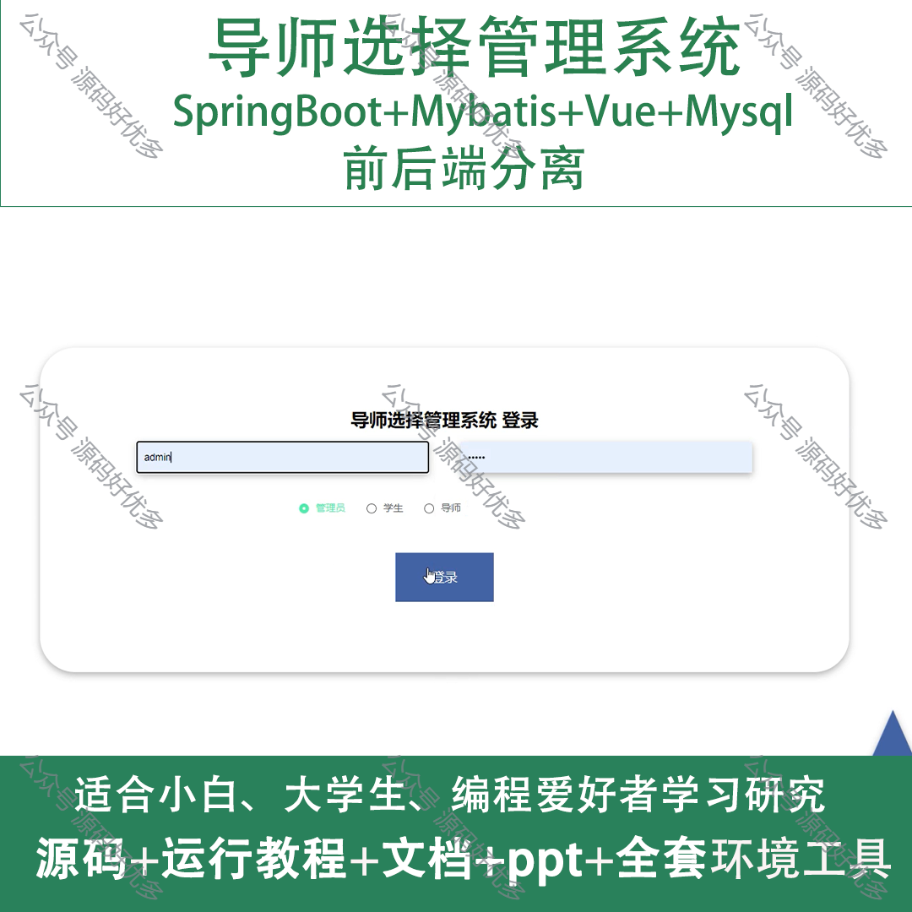
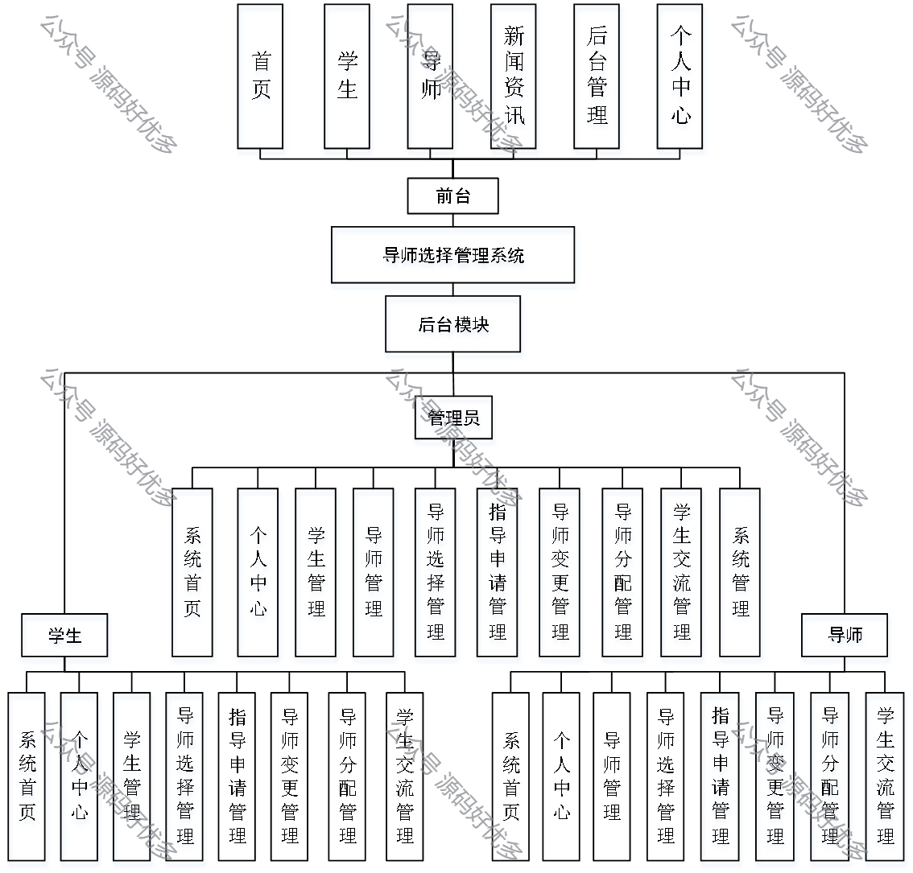
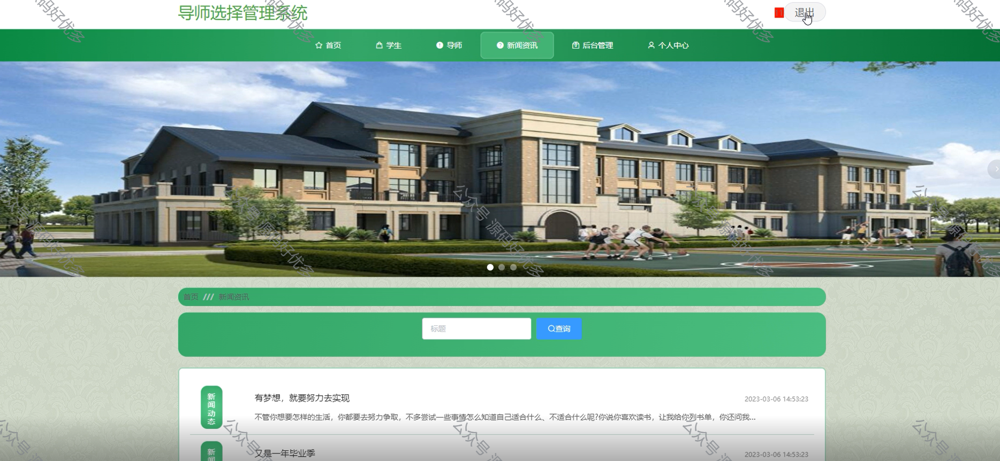
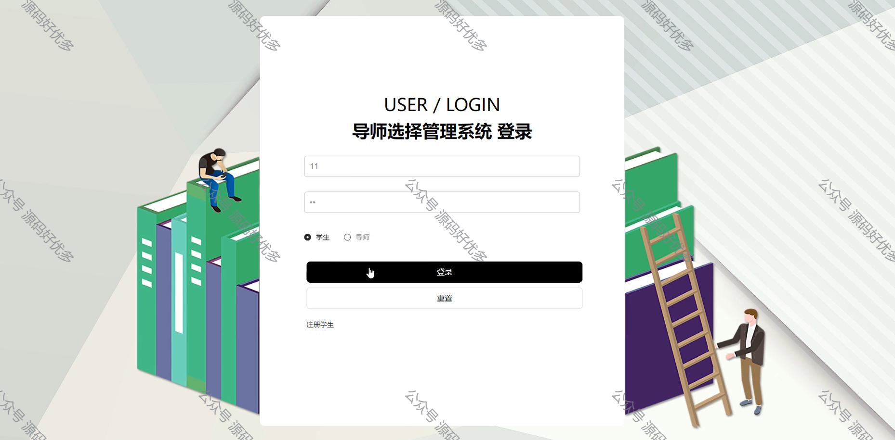
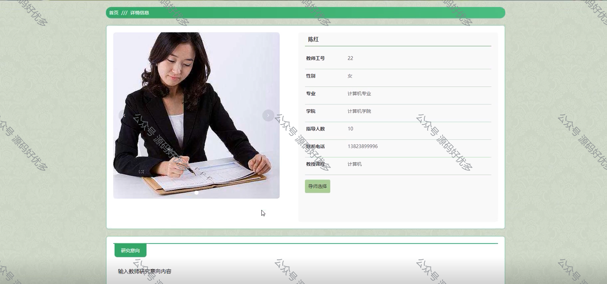
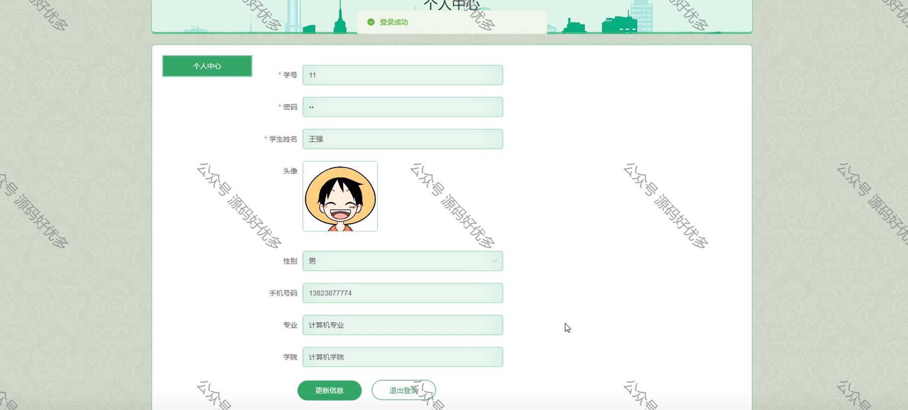
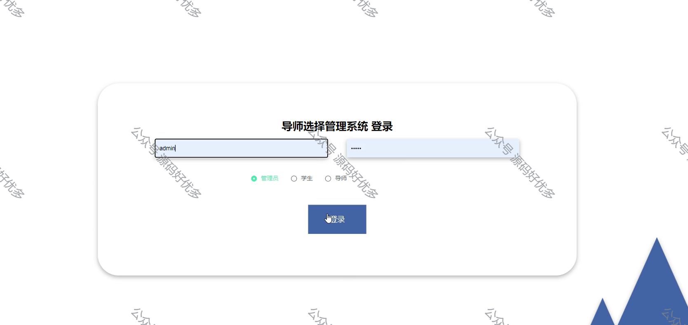
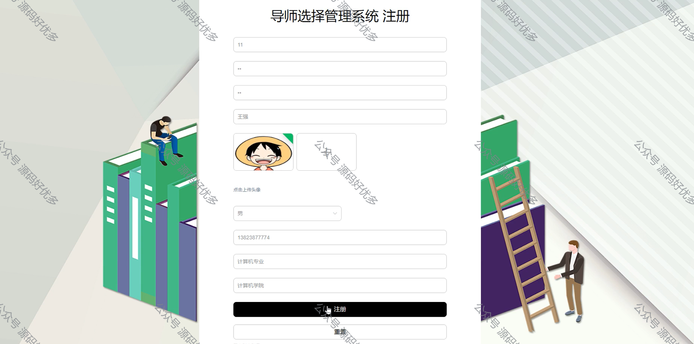
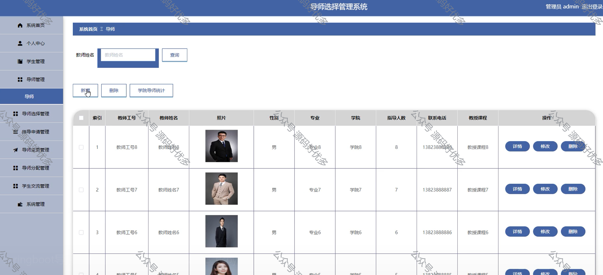
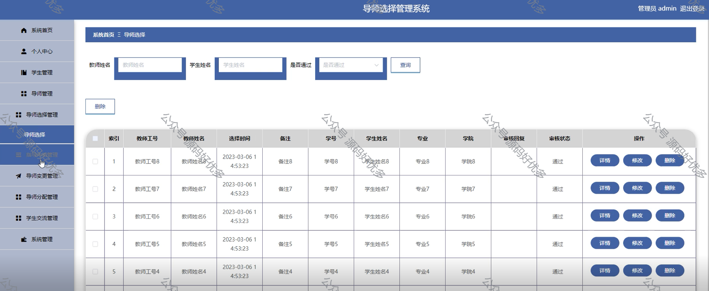
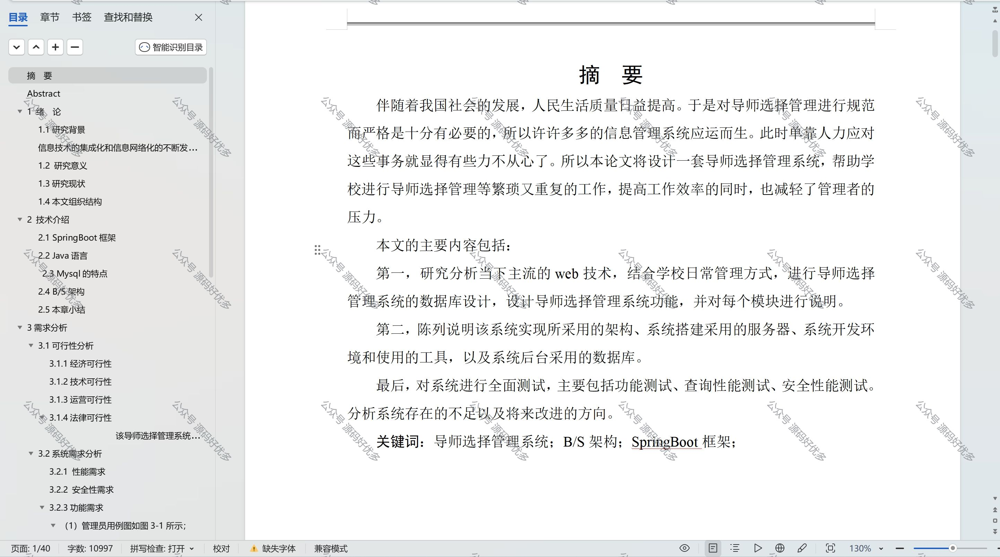

  
